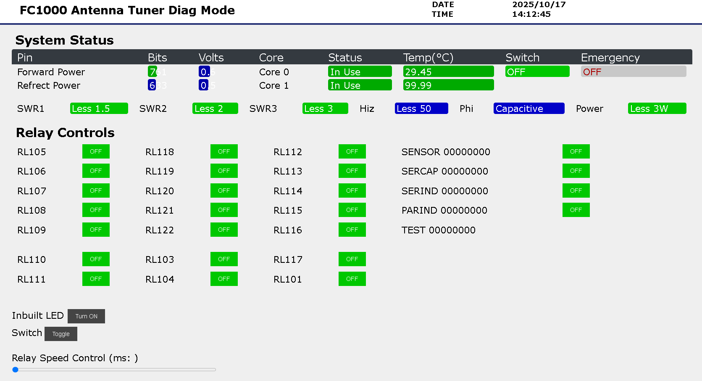
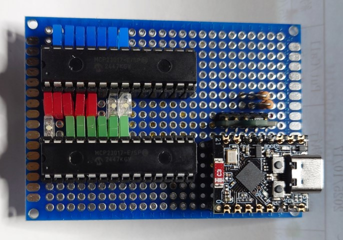
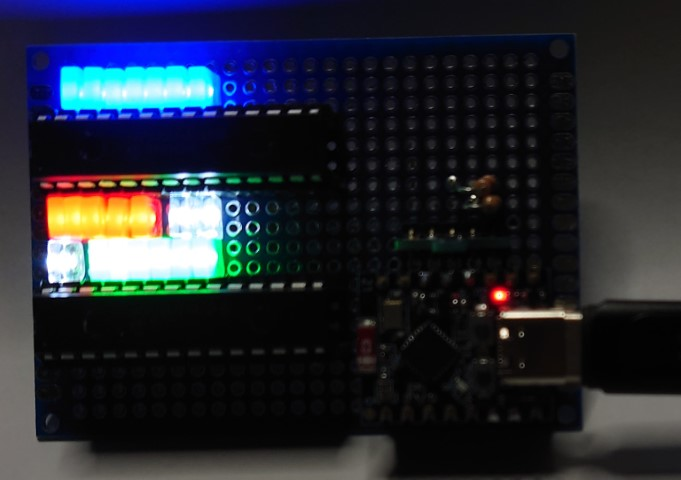

# fc1000v2
## Migrate Original CPU to ES32S3

### sercap
| bit | SERCAP | SERIND | PARIND | SENSOR | TEST |
| --- | --- | --- | ---| --- | --- |
| b0 | RL105 | RL118 | RL112 | SWR 1 | SENSOR
| b1 | RL106 | RL119 | RL113 | SWR 2 | SERCAP
| b2 | RL107 | RL120 | RL114 | SWR 3 | SERIND
| b3 | RL108 | RL121 | RL115 | Z(HiZ)| PARIND
| b4 | RL109 | RL122 | RL116 | Phi
| b5 | RL110 | |RL117 |
| b6 | RL111 | RL103 | |
| b7 | | RL104 | RL101,RL102 |

