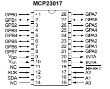
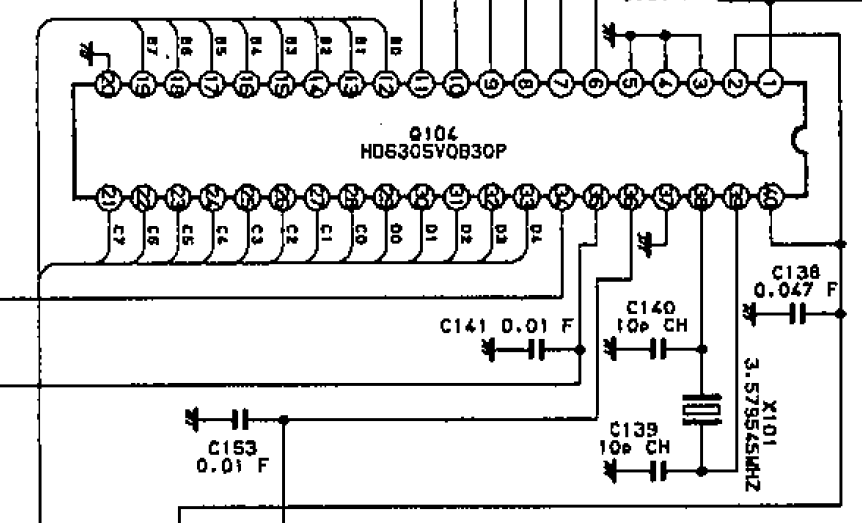

# FC1000v2 
## Migrate Original CPU to ES32C3

### sercap
| bit | COL | pin | MUX | PIN | SERCAP
| --- | --- | --- | --- | --- | ---
| b0 | BRO | 13 | GPA0A | 21 | RL105 |
| b1 | ORA | 14 | GPA1A | 22 | RL106 |
| b2 | YEL | 15 | GPA2A | 23 | RL107 |
| b3 | GRE | 16 | GPA3A | 24 | RL108 |
| b4 | BLU | 17 | GPA4A | 25 | RL109 |
| b5 | PUR | 18 | GPA5A | 26 | RL110 |
| b6 | GRA | 19 | GPA6A | 27 | RL111 |
| b7 |

### SERIND
| bit | COL | pin | MUX | PIN | SERIND
| --- | --- | --- | --- | --- | ---
| b0 | BRO | 29 | GPB0A | 1 | RL118 |
| b1 | ORA | 30 | GPB1A | 2 | RL119 |
| b2 | YEL | 31 | GPB2A | 3 | RL120 |
| b3 | GRE | 32 | GPB3A | 4 | RL121 |
| b4 | BLU | 33 | GPB4A | 5 | RL122 |
| b5 |  | |
| b6 | BRO | 28 | GPB6A | 7 | RL103 |
| b7 | ORA | 27 | GPB7A | 8 | RL104 |

### PARIND
| bit | pin | COL | MUX | PIN | PARIND |
| --- | --- | --- | --- | --- | ---
| b0 | 26 | YEL | GPA0B | 21 | RL112 |
| b1 | 25 | GRE | GPA1B | 22 | RL113 |
| b2 | 24 | BLU | GPA2B | 23 | RL114 |
| b3 | 23 | PUR | GPA3B | 24 | RL115 |
| b4 | 22 | GRA | GPA4B | 25 | RL116 |
| b5 | 21 | WHI | GPA5B | 26 | RL117 |
| b6 | | |
| b7 | 12 | BRO | GPA7B | 28 | RL101 |

### SENSOR
| bit | pin | COL | MUX | PIN | SENSOR |
| --- | --- | --- | --- | --- | ---
| b0 | 11 | BRO | GPB0B | 1 | SWR1 |
| b1 | 10 | ORA | GPB1B | 2 | SWR2 |
| b2 | 9 | YEL | GPB2B | 3 | SWR3 |
| b3 | 8 | GRE | GPB3B | 4 | Z(HiZ) |
| b4 | 7 | BLU | GPB4B | 5 | Phi |
| b5 | 6 | PUR | GPB5B | 6 | PWR3 |
| b6 | | |
| b7 | | |

### TEST
| bit | TEST |
| --- | ---
| b0 | SENSOR
| b1 | SERCAP
| b2 | SERIND
| b3 | PARIND
| b4 | 
| b5 | 
| b6 | 
| b7 | 

### Power Consumption

| Relay | Current (mA) |
| --- | ---
| All Off | 70
| All On | 576